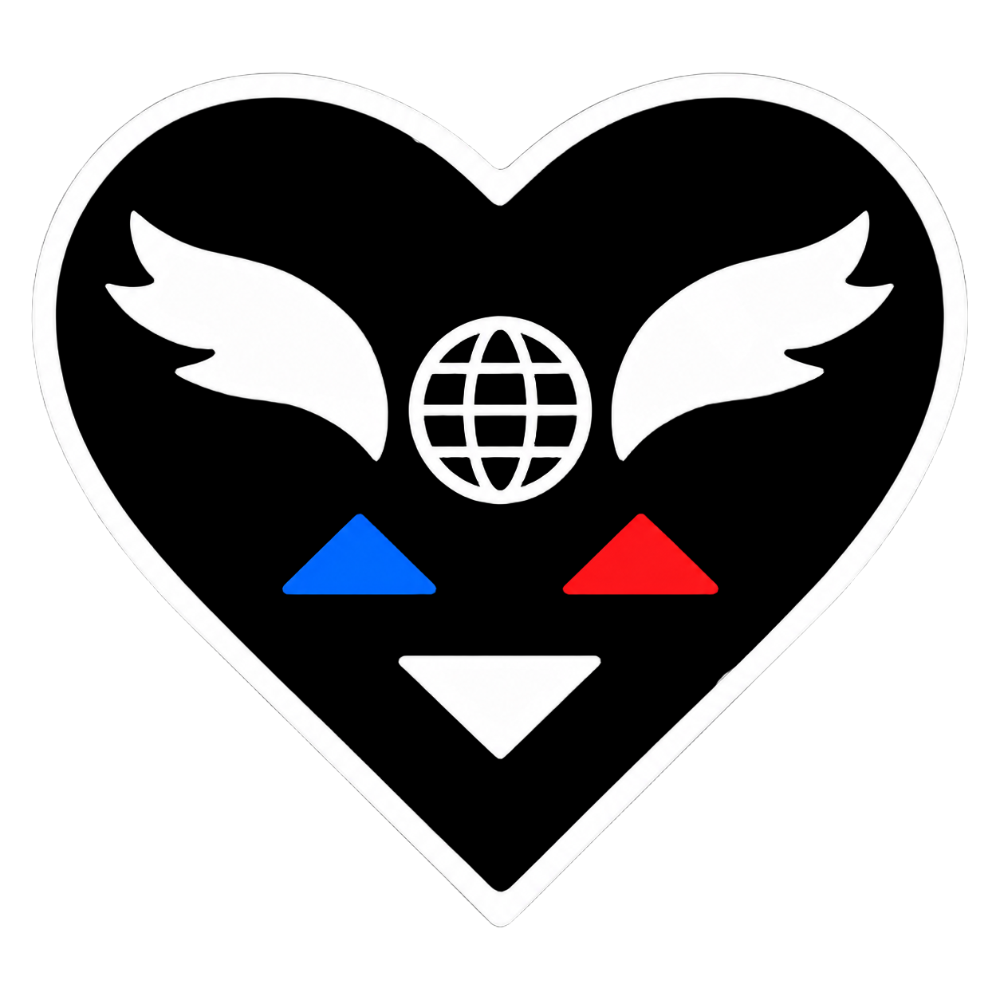
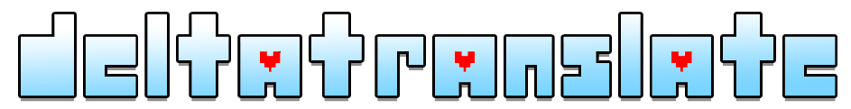

<div align="center">
  
  <br>
  

  <p><strong>L’éditeur de traduction DELTARUNE avec aperçu fidèle au moteur du jeu.</strong></p>

  <p>
    
    
    
    
  </p>
</div>

DELTATRANSLATE est une application de bureau conçue pour traduire les textes de **DELTARUNE** de l’anglais vers le français. Elle associe un éditeur rapide à une prévisualisation en temps réel des textbox : polices bitmap, portraits, couleurs, retours à la ligne, boîtes de dialogue et bulles de combat.

> [!IMPORTANT]
> DELTATRANSLATE ne distribue aucune donnée de DELTARUNE. Vous devez posséder votre propre copie du jeu et importer le `data.win` du chapitre que vous souhaitez traduire. Toutes les ressources nécessaires sont extraites localement.

## Sommaire

- [Pourquoi DELTATRANSLATE ?](#pourquoi-deltatranslate-)
- [Installation](#installation)
- [Premier démarrage](#premier-démarrage)
- [Fonctionnalités](#fonctionnalités)
- [Travailler avec Runedelta](#travailler-avec-runedelta)
- [Sauvegarde et sécurité](#sauvegarde-et-sécurité)
- [Raccourcis et codes de contrôle](#raccourcis-et-codes-de-contrôle)
- [Données locales et confidentialité](#données-locales-et-confidentialité)
- [Développement](#développement)
- [Dépannage](#dépannage)

## Pourquoi DELTATRANSLATE ?

Traduire une ligne sans la voir dans sa textbox réelle rend les problèmes de longueur, de rythme ou de portrait difficiles à détecter. DELTATRANSLATE reconstruit le comportement du writer GameMaker à partir du code du jeu afin de montrer le résultat avant même de le lancer.

| Besoin | Réponse de DELTATRANSLATE |
| --- | --- |
| Retrouver rapidement un texte | Recherche dans l’anglais, le français et les clés, avec ou sans codes de contrôle |
| Conserver le contexte | Regroupement des lignes voisines et décor de room associé quand il peut être déterminé |
| Éviter les débordements | Compteurs de colonnes et word-wrap reproduisant les règles du jeu |
| Contrôler le rendu | Prévisualisation des portraits, expressions, couleurs, styles et modes de textbox |
| Suivre l’avancement | Filtre **À traduire** et validation **OK tel quel** pour les textes volontairement identiques |
| Protéger le travail | Copies de sauvegarde horodatées et écriture sécurisée dans la cible active |

## Installation

### Prérequis

- [Node.js](https://nodejs.org/) avec `npm` ;
- une copie installée de DELTARUNE ;
- le fichier `data.win` du chapitre à traduire ;
- une connexion Internet au premier lancement si vous choisissez l’installation automatique d’UTMT.
- [Git](https://git-scm.com/) si vous souhaitez synchroniser le projet Runedelta.

### Depuis le dépôt

```bash
git clone https://github.com/ImSakushi/DELTATRANSLATE.git
cd DELTATRANSLATE
npm install
npm start
```

L’application utilise [UndertaleModTool CLI](https://github.com/UnderminersTeam/UndertaleModTool/releases/) pour lire les données du jeu. Au premier lancement, vous pourrez soit lier une installation existante, soit laisser DELTATRANSLATE télécharger la version adaptée à Windows, macOS ou Linux.

Les versions installées vérifient aussi les nouvelles releases GitHub au démarrage. Lorsqu’une version supérieure est disponible, DELTATRANSLATE propose de la télécharger, sauvegarde le travail en cours avant l’installation, puis redémarre automatiquement. Les lancements depuis le code source avec `npm start` ne déclenchent pas cette vérification.

## Premier démarrage

1. Lancez l’application avec `npm start`.
2. Cliquez sur **Installer UTMT**, ou choisissez **Lier mon dossier UTMT…** si le CLI est déjà présent sur votre machine.
3. Glissez le `data.win` d’un chapitre dans la zone d’import, ou cliquez sur **Choisir un data.win…**.
4. Patientez pendant l’extraction. Selon la machine et le chapitre, cette étape peut prendre quelques minutes.
5. Sélectionnez une ligne, saisissez sa traduction et contrôlez immédiatement son rendu dans la preview.
6. Enregistrez avec `Ctrl+S`. DELTATRANSLATE écrit dans la cible adaptée au chapitre et crée une sauvegarde avant remplacement.

Pour rejoindre Runedelta après l’import, ouvre **⇅ Runedelta**, conserve l’URL proposée et clique sur
**Connecter et installer**. Le catalogue du chapitre est alors installé dans le jeu sous le nom
`lang/lang_fr.json`.

L’import génère localement :

- le catalogue anglais et les références vers le code GML ;
- les polices bitmap et les glyphes ;
- les portraits et les éléments nécessaires aux textbox ;
- les décors de rooms et les placements utiles au contexte visuel ;
- les associations entre dialogues, personnages et expressions.

Après l’import initial, le bouton **⚙ data.win** permet de changer de chapitre ou de relancer la configuration.

## Fonctionnalités

### Édition pensée pour la traduction

- recherche EN/FR insensible aux codes de contrôle ;
- filtres **Tout**, **À traduire**, **Dialogues**, **Menus** et **Sans réf** ;
- liste virtualisée, adaptée aux catalogues contenant plusieurs milliers de lignes ;
- navigation directe entre les prochaines traductions à effectuer ;
- copie du texte anglais ou de ses seuls tags de début et de fin ;
- coloration des codes de contrôle dans l’éditeur ;
- historique annuler/rétablir indépendant pour chaque ligne ;
- deux thèmes d’interface : DELTARUNE et classique.

### Preview fidèle au jeu

- modes automatiques et manuels : **Monde Sombre**, **Monde Clair**, **Shop**, **Bulle de combat**, **Texte de combat** et **Texte libre** ;
- polices bitmap, espacements et couleurs extraits depuis votre `data.win` ;
- détection automatique du portrait et de son expression depuis le GML ;
- substitution des arguments `~1`, `~2`, etc. ;
- reproduction du word-wrap et des limites de colonnes du writer ;
- décor contextuel 640×480 avec nom de room et choix manuel lorsque plusieurs scènes sont possibles ;
- comparaison rapide de la preview française avec le texte anglais.

### Sprites traduits

- onglet dédié avec recherche, filtres et liste virtualisée de tous les sprites du chapitre ;
- détection automatique des variantes portant le suffixe `_fr` ;
- comparaison pixelisée de l'original et de la version utilisée en français, frame par frame ;
- export de la frame originale en PNG pour la retoucher dans l'éditeur d'images de son choix ;
- import d'un PNG par clic ou glisser-déposer, avec contrôle strict des dimensions ;
- si une variante `_fr` existe, elle est modifiée ; sinon l'image source est remplacée uniquement dans la copie recompilée ;
- annulation indépendante de chaque frame et réapplication automatique des imports lors des recompilations suivantes.

## Travailler avec Runedelta

DELTATRANSLATE sait utiliser directement le dépôt
[Traducteurs-Aurifiques/Runedelta](https://github.com/Traducteurs-Aurifiques/Runedelta) comme source de
traduction pour les chapitres 1 à 5. Les fichiers `strings/strings_chapitre_N.json` du dépôt possèdent le
même schéma que les catalogues du jeu ; l’application installe donc une copie active nommée
`lang_fr.json` sans convertir ni réordonner les clés.

1. Importe le `data.win` du chapitre dans DELTATRANSLATE.
2. Ouvre **⇅ Runedelta**, puis clique sur **Connecter et installer**.
3. Traduis normalement et sauvegarde avec `Ctrl+S`.

Cette installation est confirmée une fois par chapitre : changer de `data.win` ne mélange donc jamais
automatiquement le catalogue d’un autre projet avec Runedelta.

À la connexion, le `lang_fr.json` éventuellement présent est sauvegardé avant d’être remplacé par le
catalogue Runedelta. Ensuite, chaque sauvegarde :

- récupère les nouveaux commits GitHub ;
- fusionne les changements clé par clé avec le travail local ;
- écrit le résultat dans `lang/lang_fr.json` et dans le fichier du dépôt ;
- crée un commit `trad: synchroniser le chapitre N` ;
- pousse le commit si l’utilisateur Git configuré possède les droits d’écriture.

Pour chaque valeur différente de l’anglais, la liste et l’éditeur affichent aussi le dernier auteur Git de
la ligne. L’infobulle indique la date, le message et le commit issus de `git blame`.

Deux personnes peuvent ainsi modifier des clés différentes sans conflit. Si la même clé a reçu deux
traductions différentes, aucune version n’est écrasée : DELTATRANSLATE affiche les deux valeurs et demande
de choisir `LOCAL` ou `GITHUB`. Sans réseau ou sans droit de push, la sauvegarde locale et le commit sont
conservés ; le bouton Runedelta reste en avertissement et une synchronisation ultérieure reprend le commit.

L’application ne stocke aucun token GitHub. Elle utilise Git et son gestionnaire d’identifiants déjà
configuré sur la machine. Les membres sans droit d’écriture peuvent cloner et installer le projet, mais le
push restera en attente jusqu’à l’utilisation d’un compte autorisé ou d’un fork accessible en écriture.
Si aucun nom ou e-mail Git n’existe, DELTATRANSLATE configure uniquement dans son clone une identité
générique `Traducteur Runedelta`, sans modifier la configuration Git globale.

## Sauvegarde et sécurité

Le mode de sauvegarde est sélectionné automatiquement selon le chapitre :

| Situation détectée | Cible utilisée | Protection appliquée |
| --- | --- | --- |
| `lang/lang_fr.json` existe | Le fichier français existant | Backup horodaté avant écriture |
| Runedelta est connecté | `lang/lang_fr.json` + `strings_chapitre_N.json` | Fusion clé par clé, commit local, puis push |
| Le chapitre lit ses textes depuis `lang_en.json` | `lang_en.json` | Conservation de `lang_en.json.original` comme référence anglaise |
| Les textes doivent être recompilés dans le jeu | `data.win` actif | Conservation de `data-original.win`, génération temporaire et remplacement atomique |

Garanties importantes :

- le `data.win` utilisé comme source d’extraction reste en lecture seule ;
- le fichier anglais de référence n’est jamais normalisé ni réordonné ;
- jusqu’à **40 sauvegardes** sont conservées par cible ;
- une copie automatique supplémentaire est créée après 30 minutes de modifications non enregistrées ;
- si le remplacement d’un `data.win` échoue, le fichier précédent est restauré ;
- les validations, choix de portrait, modes et autres préférences sont conservés séparément.

Le bouton **🗁 Backups** ouvre directement le dossier contenant les copies de sécurité.

## Raccourcis et codes de contrôle

### Raccourcis

| Touche | Action |
| --- | --- |
| `Ctrl+S` / `Cmd+S` | Sauvegarder dans la cible active |
| `Ctrl+↓` / `Ctrl+↑` | Aller à la traduction suivante / précédente |
| `Ctrl+Entrée` ou `Ctrl+D` | Marquer ou démarquer la ligne comme **OK tel quel**, puis avancer |
| `Ctrl+Z` / `Ctrl+Y` | Annuler / rétablir dans la ligne active |
| `Entrée` | Insérer un saut de ligne du jeu (`&`) |
| `Maj+Entrée` | Insérer une vraie nouvelle ligne dans la valeur |
| `Alt` | Ouvrir la roue d’insertion rapide des tags |

### Codes principaux

| Code | Effet |
| --- | --- |
| `&` | Saut de ligne dans la textbox |
| `^1`…`^9` | Pause pendant l’affichage |
| `~1`, `~2`, … | Argument substitué par le jeu |
| `/` | Attendre la confirmation du joueur |
| `%` | Passer au message suivant |
| `/%` | Terminer la séquence |
| `\E?` | Expression du portrait |
| `\F?` | Personnage du portrait |
| `\c?` | Couleur du texte |
| `\T?` | Voix ou style de texte |
| `\|` | Espace fine |
| `` \` `` | Échapper le caractère suivant |

## Données locales et confidentialité

Le dépôt et les livrables contiennent uniquement le code de DELTATRANSLATE. Aucun `data.win`, texte, sprite, portrait, décor, son ou fichier extrait de DELTARUNE n’est inclus.

Les fichiers générés lors d’un import restent sur votre machine :

- extraction UTMT et références locales ;
- traductions intermédiaires ;
- préférences par clé ;
- sauvegardes horodatées ;
- installation UTMT gérée par l’application, le cas échéant.
- clone Git local de Runedelta, si la synchronisation a été activée.

Ces données sont placées dans le dossier utilisateur de l’application. Les anciennes installations qui possèdent déjà `config.json`, `prefs.json`, `backups/` ou `extracted-imports/` à côté du code continuent d’utiliser ces emplacements afin de ne pas perdre le travail existant.

## Développement

### Architecture

```text
main.js                       Processus principal Electron, IPC et sauvegardes
updater.js                    Détection, téléchargement et installation des releases GitHub
runedelta-sync.js             Clone, fusion à trois versions, commit et push Runedelta
preload.js                    API sécurisée exposée au renderer
src/app.js                    Interface, navigation et état de l’éditeur
src/sprites.js                Catalogue, comparaison et import des sprites traduits
src/engine/writer.js          Word-wrap et interprétation des codes de contrôle
src/engine/preview.js         Rendu canvas des différents modes de texte
src/engine/bitmapfont.js      Chargement et teinte des polices bitmap
extraction/import-datawin.mjs Pipeline d’import complet via UTMT
extraction/import-lib.mjs     Analyse du GML et construction du catalogue
extraction/export-sprite.mjs  Extraction à la demande des aperçus de sprites
extraction/patch-datawin.mjs  Recompilation sécurisée des traductions
```

Le processus principal et le preload sont en CommonJS. Le renderer et les scripts d’extraction utilisent les modules ESM.

### Releases et mises à jour

Le tag GitHub doit toujours correspondre à la version de `package.json` (`v1.1.0` pour la version `1.1.0`) ; le workflow refuse sinon de publier. Il joint automatiquement l’installateur, les métadonnées `latest*.yml` et les blockmaps utilisées par l’updater.

Les releases doivent être lisibles publiquement pour que les installations puissent les consulter sans secret. Ne jamais embarquer de token GitHub dans l’application. Sur macOS, les mises à jour automatiques nécessitent également une application signée.

### Commandes utiles

```bash
# Lancer l’application
npm start

# Import avancé ou régénération complète d’un chapitre
node extraction/import-datawin.mjs \
  --datawin "/chemin/vers/data.win" \
  --cli "/chemin/vers/UndertaleModCli" \
  --force
```

Toute modification du rendu doit pouvoir être reliée au comportement observé dans le GML décompilé. Les données extraites servent uniquement de cache local de développement et ne doivent jamais être ajoutées au dépôt.

## Dépannage

<details>
<summary><strong>L’application demande UTMT à chaque lancement</strong></summary>

Vérifiez que le dossier sélectionné contient bien `UndertaleModCli.exe` sous Windows ou `UndertaleModCli` sous macOS/Linux. Vous pouvez aussi utiliser **Installer UTMT** pour laisser l’application gérer son emplacement.
</details>

<details>
<summary><strong>L’import semble bloqué</strong></summary>

La première extraction décompile le code et exporte plusieurs ressources ; elle peut rester plusieurs minutes sur une même étape. Consultez le journal affiché dans la fenêtre d’import avant d’interrompre l’opération.
</details>

<details>
<summary><strong>Une ligne reste dans « À traduire » alors que le français est identique</strong></summary>

C’est volontaire : une ligne est considérée comme non traduite lorsque son texte français est identique à l’anglais. Utilisez `Ctrl+Entrée` ou `Ctrl+D` pour la marquer **OK tel quel**.
</details>

<details>
<summary><strong>Le jeu a été mis à jour</strong></summary>

Relancez un import complet avec l’option `--force` afin de régénérer le code, les ressources, le catalogue et les décors depuis le nouveau `data.win`.
</details>

## Projet non officiel

DELTATRANSLATE est un projet communautaire non officiel, sans affiliation avec les créateurs ou éditeurs de DELTARUNE. Les noms et marques cités appartiennent à leurs détenteurs respectifs.
